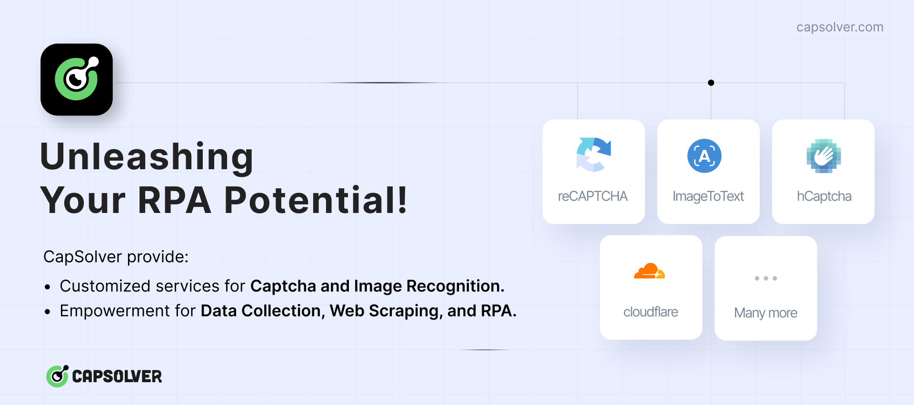

# Cloudflare Turnstile Page & Captcha Bypass for Scraping

**We love scraping, don't we?** But sometimes, we face Cloudflare protection. This script is designed to bypass the Cloudflare protection on websites, allowing you to interact with them programmatically. 

# Sponsors
### [Capsolver](https://www.capsolver.com/?utm_source=github&utm_medium=ads&utm_campaign=scraping&utm_term=CloudflareBypassForScraping)

[](https://www.capsolver.com/?utm_source=github&utm_medium=ads&utm_campaign=scraping&utm_term=CloudflareBypassForScraping)

# How does this script work?

If you use Selenium, you may have noticed that it is not possible to bypass Cloudflare protection with it. Even you click the "I'm not a robot" button, you will still be stuck in the "Checking your browser before accessing" page.
This is because Cloudflare protection is able to detect the automation tools and block them, which puts the webdriver infinitely in the "Checking your browser before accessing" page.

As you realize, the script uses the DrissionPage, which is a controller for the browser itself. This way, the browser is not detected as a webdriver and the Cloudflare protection is bypassed.


## Installation

You can install the required packages by running the following command:

```bash
pip install -r requirements.txt
```

## Demo


## Usage

Create a new instance of the `CloudflareBypass` class and call the `bypass` method when you need to bypass the Cloudflare protection.

```python
from CloudflareBypasser import CloudflareBypasser
from DrissionPage import ChromiumPage

driver = ChromiumPage()
driver.get('https://nopecha.com/demo/cloudflare')

cf_bypasser = CloudflareBypasser(driver)
cf_bypasser.bypass()
```

You can run the test script to see how it works:

```bash
python test.py
```

# Introducing Server Mode

Recently, [@frederik-uni](https://github.com/frederik-uni) has introduced a new feature called "Server Mode". This feature allows you to bypass the Cloudflare protection remotely, either you can get the cookies or the HTML content of the website.

## Installation

You can install the required packages by running the following command:

```bash
pip install -r server_requirements.txt
```

## Usage

Start the server by running the following command:

```bash
python server.py
```

Two endpoints are available:

- `/cookies?url=<URL>&retries=<>`: This endpoint returns the cookies of the website (including the Cloudflare cookies).
- `/html?url=<URL>&retries=<>`: This endpoint returns the HTML content of the website.

Send a GET request to the desired endpoint with the URL of the website you want to bypass the Cloudflare protection.

```bash
sarp@IdeaPad:~/$ curl http://localhost:8000/cookies?url=https://nopecha.com/demo/cloudflare
{"cookies":{"cf_clearance":"SJHuYhHrTZpXDUe8iMuzEUpJxocmOW8ougQVS0.aK5g-1723665177-1.0.1.1-5_NOoP19LQZw4TQ4BLwJmtrXBoX8JbKF5ZqsAOxRNOnW2rmDUwv4hQ7BztnsOfB9DQ06xR5hR_hsg3n8xteUCw"},"user_agent":"Mozilla/5.0 (X11; Linux x86_64) AppleWebKit/537.36 (KHTML, like Gecko) Chrome/125.0.0.0 Safari/537.36"}
```

## Docker


You can also run the server in a Docker container. Thanks to [@gandrunx](https://github.com/gandrunx) for Dockerizing the server.

First, build the Docker image:

```bash
docker build -t cloudflare-bypass .
```

Then, run the Docker container:

```bash
docker run -p 8000:8000 cloudflare-bypass
```

Alternatively, you can skip `docker build` step, and run the container using pre-build image:
```bash
docker run -p 8000:8000 ghcr.io/sarperavci/cloudflarebypassforscraping:latest
```

# What is this not?

This script is not related to bring a solution to bypass if your IP is blocked by Cloudflare. If you are blocked by Cloudflare, you need a clean IP to access the website. This script is designed to bypass the Cloudflare protection, not to bypass the IP block.

## Drissionpage
To find out more about DrissionPage, you can get more information from the following links:
- [Official Github](https://github.com/g1879/DrissionPage)
  
- [Documantation](https://drissionpage.cn/)

Be sure you use a translation tool if you don't speak Chinese.

## Star History

<a href="https://star-history.com/#sarperavci/CloudflareBypassForScraping&Date">
 <picture>
   <source media="(prefers-color-scheme: dark)" srcset="https://api.star-history.com/svg?repos=sarperavci/CloudflareBypassForScraping&type=Date&theme=dark" />
   <source media="(prefers-color-scheme: light)" srcset="https://api.star-history.com/svg?repos=sarperavci/CloudflareBypassForScraping&type=Date" />
   
 </picture>
</a>
